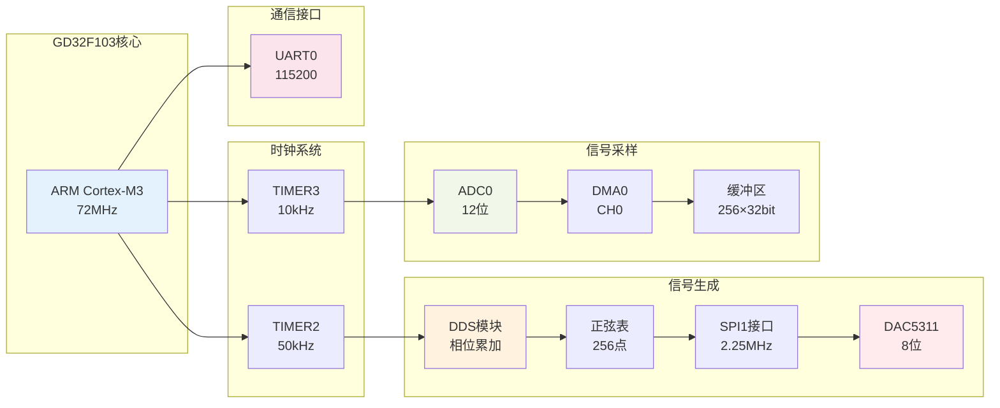
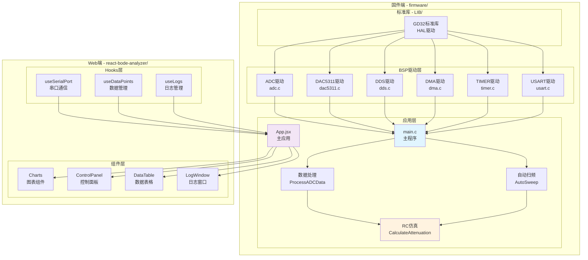
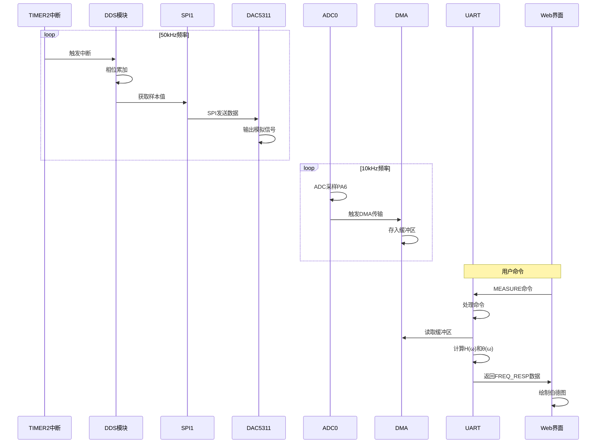

# 项目二：GD32伯德图分析仪 - 结构框图

## 1. 系统整体架构

```mermaid
graph TB
    subgraph "硬件层 - GD32F103"
        A[TIMER2<br/>50kHz中断] --> B[DDS相位累加器]
        B --> C[正弦表查找<br/>256点]
        C --> D[SPI1接口<br/>PB13/PB15/PB12]
        D --> E[DAC5311<br/>8位DAC]
        E --> F[模拟信号输出<br/>0.5-1.5V]
        
        F --> G[PA6<br/>ADC0_CH6]
        G --> H[ADC采样<br/>12位/10kHz]
        H --> I[DMA传输<br/>256点缓冲]
        
        I --> J[数据处理<br/>峰峰值/直流偏移]
        J --> K[RC滤波仿真<br/>H=1/√(1+(f/fc)²)]
        K --> L[UART0<br/>115200bps]
    end
    
    subgraph "通信层"
        L --> M[USB转TTL<br/>CH340/CP2102]
        M --> N[串口数据<br/>FREQ_RESP格式]
    end
    
    subgraph "应用层 - Web界面"
        N --> O[Web Serial API<br/>浏览器串口]
        O --> P[React应用<br/>数据解析]
        P --> Q[Chart.js<br/>实时绘图]
        Q --> R[伯德图显示<br/>幅频/相频曲线]
        P --> S[数据导出<br/>CSV格式]
    end
    
    style A fill:#e1f5ff
    style E fill:#ffebee
    style G fill:#fff3e0
    style L fill:#e8f5e9
    style O fill:#f3e5f5
    style R fill:#fff9c4
```

---

## 2. 硬件模块结构



---

## 3. 软件模块结构



---

## 4. 数据流结构



---

## 5. 引脚分配图

```
GD32F103引脚分配：

┌────────────────────────────────────────┐
│          GD32F103RCT6                  │
├────────────────────────────────────────┤
│                                        │
│  SPI1 接口（DAC5311）:                 │
│    PB13  →  SCK   (SPI时钟)           │
│    PB15  →  MOSI  (SPI数据)           │
│    PB12  →  CS    (片选)              │
│                                        │
│  ADC 采样:                             │
│    PA6   →  ADC0_CH6  (输入信号)      │
│    PA7   →  ADC1_CH7  (预留/未用)     │
│                                        │
│  UART 通信:                            │
│    PA9   →  USART0_TX  (发送)         │
│    PA10  →  USART0_RX  (接收)         │
│                                        │
│  电源:                                 │
│    VDD   →  3.3V                      │
│    VSS   →  GND                       │
│                                        │
└────────────────────────────────────────┘

外部连接：
  DAC5311 → 模拟信号输出 → PA6 (ADC采样)
  UART0   → USB转TTL     → PC串口
```

---

## 6. 文件组织结构

```
Project 2_硬件版/
│
├── 01_项目结构框图.md          # 本文件
├── 02_系统流程图.md            # 工作流程
├── 03_信号流图.md              # 信号处理流程
├── README.md                   # 项目说明
├── 硬件连接图.txt              # 硬件连接参考
│
├── firmware/                   # 固件代码
│   ├── BSP/                    # 板级支持包
│   │   ├── ADC/               # ADC驱动
│   │   ├── DAC5311/           # DAC5311驱动
│   │   ├── DDS/               # DDS信号发生器
│   │   ├── DMA/               # DMA传输
│   │   ├── FILTER/            # 滤波器（备用）
│   │   ├── SINE/              # 正弦表
│   │   ├── TIMER/             # 定时器
│   │   └── USART/             # 串口
│   ├── LIB/                   # GD32标准库
│   └── USER/                  # 用户代码
│       ├── main.c             # 主程序
│       └── main.h             # 头文件
│
└── react-bode-analyzer/       # Web界面
    ├── src/
    │   ├── components/        # React组件
    │   ├── hooks/             # 自定义Hooks
    │   └── styles/            # 样式文件
    └── package.json           # 依赖配置
```

---

## 7. 技术规格总览

| 模块 | 参数 | 数值 |
|------|------|------|
| **MCU** | 型号 | GD32F103RCT6 |
| | 内核 | ARM Cortex-M3 |
| | 频率 | 72MHz |
| | Flash | 256KB |
| | RAM | 48KB |
| **DDS** | 采样率 | 50kHz |
| | 频率范围 | 10Hz - 1000Hz |
| | 波形表 | 256点 |
| | 相位累加器 | 32位 |
| **DAC** | 型号 | DAC5311 |
| | 分辨率 | 8位 |
| | 接口 | SPI1 |
| | 速率 | 2.25MHz |
| **ADC** | 分辨率 | 12位 |
| | 采样率 | 10kHz |
| | 通道 | ADC0_CH6 |
| | 缓冲区 | 256点 |
| **通信** | 接口 | UART0 |
| | 波特率 | 115200 |
| | 数据位 | 8位 |
| | 停止位 | 1位 |
| **RC仿真** | 截止频率 | 159Hz |
| | 电阻R | 10kΩ |
| | 电容C | 100nF |
| | 精度 | <1% |

---

## 8. 系统特点

### ✅ 硬件特点
- 高精度DDS信号发生器
- 8位DAC输出，波形质量好
- 12位ADC采样，分辨率高
- DMA传输，CPU占用低

### ✅ 软件特点
- 整数运算，无浮点运算
- 软件RC仿真，精度极高
- 模块化设计，易于扩展
- 完善的错误处理

### ✅ 界面特点
- Web Serial API，免驱动
- 实时图表显示
- CSV数据导出
- 现代化UI设计

---

**文档版本**: v1.0  
**更新日期**: 2025-10-18  
**适用项目**: GD32F103 伯德图分析仪


