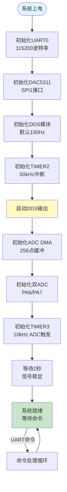
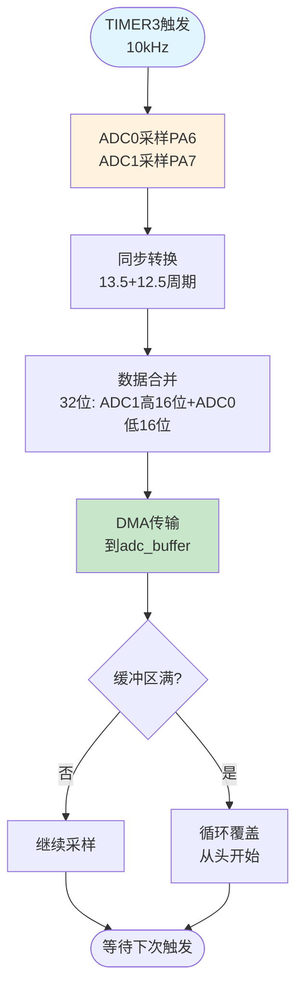
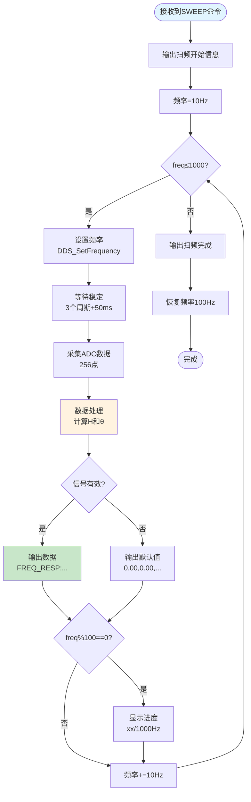
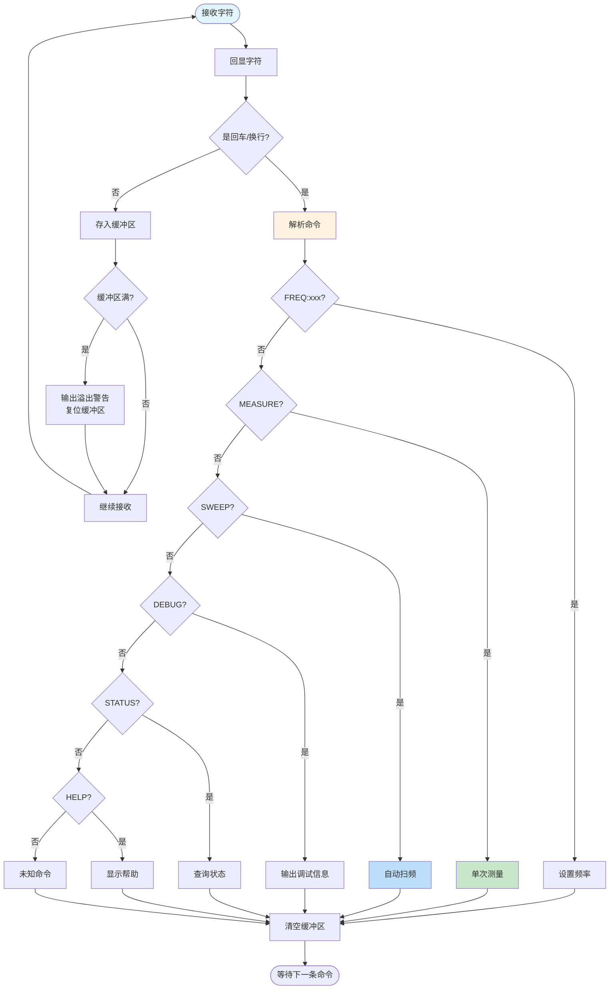
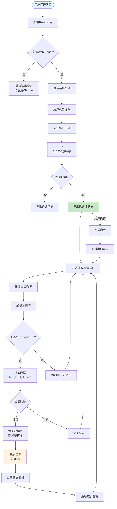
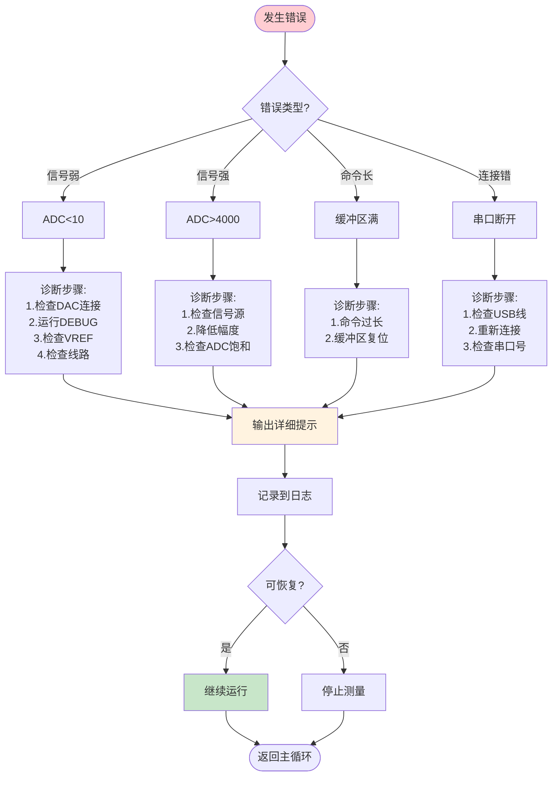

# 项目二：GD32伯德图分析仪 - 系统流程图

## 1. 系统启动流程



---

## 2. DDS信号生成流程

```mermaid
flowchart TD
    Start([TIMER2中断<br/>50kHz]) --> Acc[相位累加器<br/>+=phase_increment]
    Acc --> Index[计算索引<br/>index=(phase>>24)&0xFF]
    Index --> Lookup[查表<br/>sample=sine_table[index]]
    Lookup --> SPI[SPI1发送<br/>DAC5311_Write]
    SPI --> CS1[CS拉低]
    CS1 --> Send[发送8位数据]
    Send --> CS2[CS拉高]
    CS2 --> DAC[DAC5311输出<br/>模拟电压]
    DAC --> End([中断返回])
    
    style Start fill:#e1f5ff
    style Lookup fill:#fff3e0
    style DAC fill:#ffcdd2
```

---

## 3. ADC采样流程



---

## 4. 数据处理流程

```mermaid
flowchart TD
    Start([接收到MEASURE命令]) --> Extract[提取ADC数据<br/>256点]
    Extract --> CalcPP[计算峰峰值<br/>找最大最小值]
    CalcPP --> Check{信号强度?}
    Check --> |<10| Error[输出错误提示<br/>检查连接]
    Check --> |10-4000| Normal[正常范围]
    Check --> |>4000| Warning[输出警告<br/>信号过强]
    
    Normal --> Voltage[转换电压<br/>mV=(ADC×3300)/4096]
    Warning --> Voltage
    
    Voltage --> GetFreq[获取当前频率]
    GetFreq --> CalcH[计算H(f)<br/>H=1/√(1+(f/fc)²)]
    CalcH --> CalcK1[计算输出<br/>K₁=K×H(f)]
    CalcK1 --> CalcTheta[计算相位<br/>θ=-arctan(f/fc)]
    CalcTheta --> CalcDC[计算直流偏移]
    CalcDC --> Output[输出结果<br/>FREQ_RESP格式]
    Output --> End([完成])
    
    Error --> End
    
    style Start fill:#e1f5ff
    style Check fill:#fff9c4
    style CalcH fill:#c8e6c9
    style Output fill:#bbdefb
```

---

## 5. 自动扫频流程



---

## 6. UART命令处理流程



---

## 7. Web界面交互流程



---

## 8. RC滤波仿真计算流程

```mermaid
flowchart TD
    Start([输入: freq, fc]) --> CalcRatio[计算比值<br/>ratio=freq×100/fc]
    CalcRatio --> Square[计算平方<br/>ratio_sq=ratio²]
    Square --> Denom[计算分母<br/>denom=10000+ratio_sq]
    
    Denom --> InitX[初始化x=denom/2]
    InitX --> Loop{迭代10次}
    
    Loop --> |继续| Newton[牛顿迭代<br/>x_new=(x+denom/x)/2]
    Newton --> Converge{x_new==x?}
    Converge --> |是| Break[提前退出]
    Converge --> |否| Update[x=x_new]
    Update --> Loop
    
    Loop --> |完成| CalcH[计算H<br/>H=1000000/x]
    Break --> CalcH
    
    CalcH --> Phase1{freq<fc/4?}
    Phase1 --> |是| Linear[线性近似<br/>θ≈-f/fc×45°]
    Phase1 --> |否| Phase2{freq<fc?}
    
    Phase2 --> |是| Inter1[插值计算<br/>到-45°]
    Phase2 --> |否| Phase3{freq<2fc?}
    
    Phase3 --> |是| Inter2[插值计算<br/>到-63.4°]
    Phase3 --> |否| Phase4{freq<4fc?}
    
    Phase4 --> |是| Inter3[插值计算<br/>到-76°]
    Phase4 --> |否| Asymp[渐近线<br/>θ→-90°]
    
    Linear --> Return[返回: H×10000, θ×100]
    Inter1 --> Return
    Inter2 --> Return
    Inter3 --> Return
    Asymp --> Return
    
    Return --> End([完成])
    
    style Start fill:#e1f5ff
    style Newton fill:#fff3e0
    style CalcH fill:#c8e6c9
```

---

## 9. 错误处理流程



---

## 10. 系统时序图

```mermaid
gantt
    title 系统运行时序（1秒内）
    dateFormat SSS
    axisFormat %L ms
    
    section TIMER2 (50kHz)
    DDS中断 :active, t1, 000, 20ms
    DDS中断 :active, t2, 020, 20ms
    DDS中断 :active, t3, 040, 20ms
    DDS中断 :active, t4, 060, 20ms
    DDS中断 :active, t5, 080, 20ms
    
    section TIMER3 (10kHz)
    ADC触发 :crit, a1, 000, 100ms
    ADC触发 :crit, a2, 100, 100ms
    ADC触发 :crit, a3, 200, 100ms
    ADC触发 :crit, a4, 300, 100ms
    
    section DMA传输
    数据传输 :done, d1, 000, 100ms
    数据传输 :done, d2, 100, 100ms
    数据传输 :done, d3, 200, 100ms
    
    section 主循环
    空闲等待 :active, m1, 000, 100ms
    处理命令 :m2, 100, 50ms
    空闲等待 :active, m3, 150, 150ms
```



---

**文档版本**: v1.0  
**更新日期**: 2025-10-18  
**适用项目**: GD32F103 伯德图分析仪


