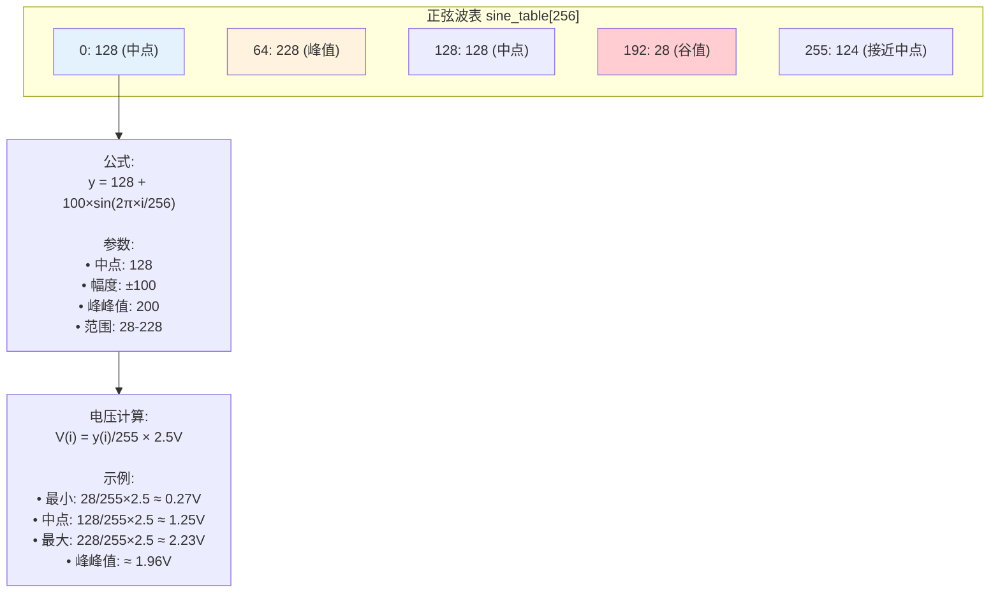
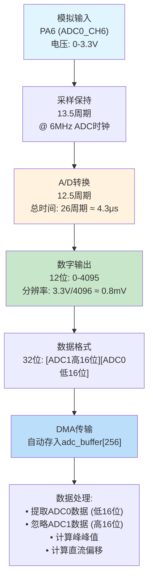
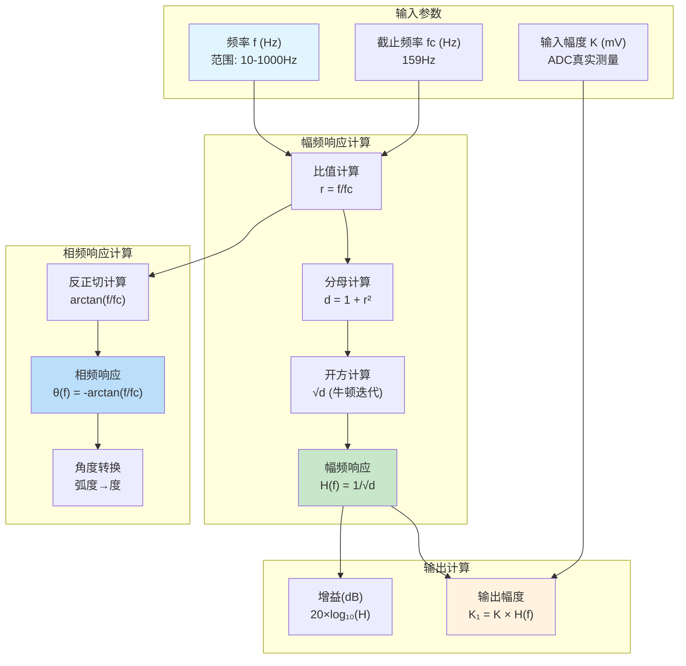
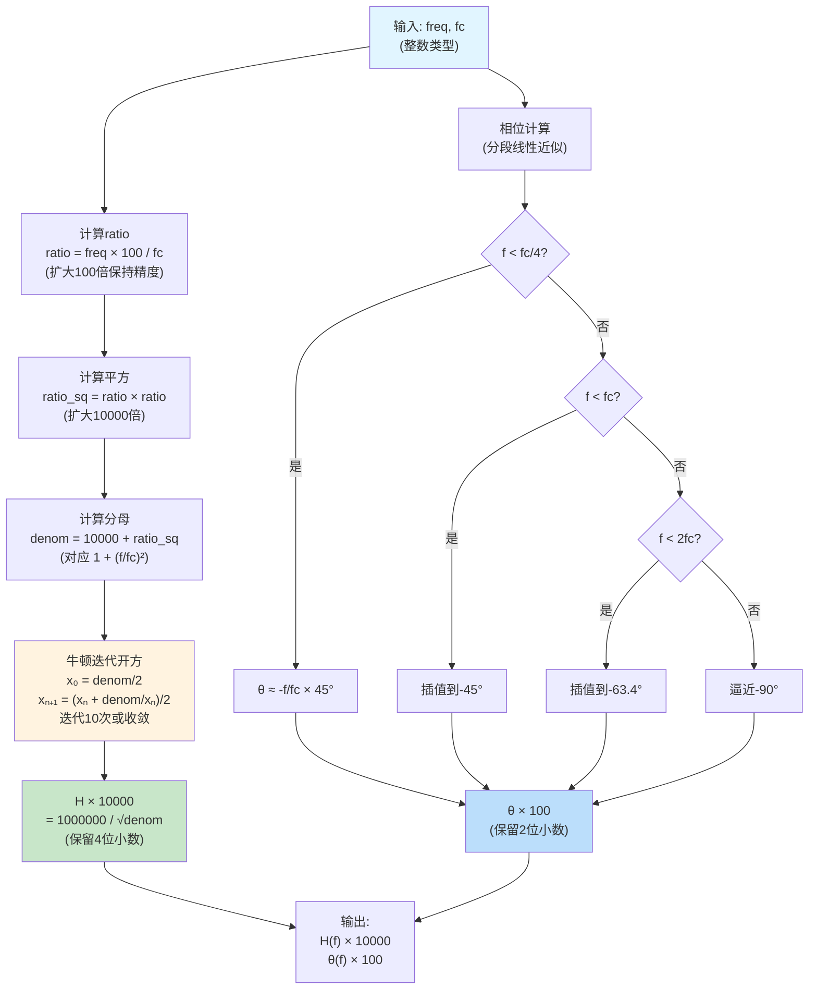
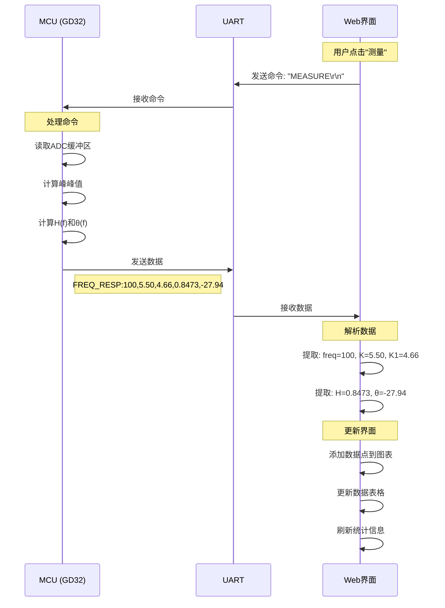
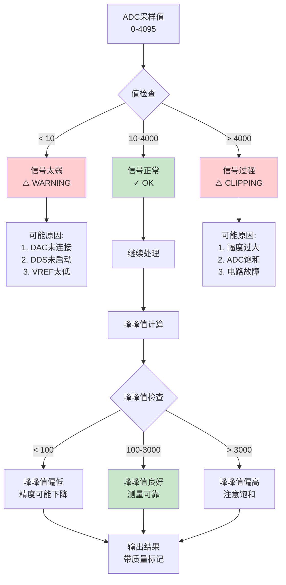

# 项目二：GD32伯德图分析仪 - 信号流图

## 1. 信号处理全流程

```mermaid
flowchart LR
    subgraph "信号生成"
        T[TIMER2<br/>50kHz] --> P[相位累加器<br/>32位]
        P --> S[正弦表<br/>256点]
        S --> D[DAC5311<br/>8位]
    end
    
    subgraph "信号输出"
        D --> V[模拟电压<br/>0-2.5V]
        V --> O[输出幅度<br/>峰峰值≈0.5V]
    end
    
    subgraph "信号采样"
        O --> A[ADC0<br/>PA6]
        A --> C[12位采样<br/>10kHz]
        C --> DMA[DMA传输<br/>256点]
    end
    
    subgraph "信号处理"
        DMA --> PP[峰峰值计算<br/>max-min]
        PP --> DC[直流偏移<br/>平均值]
        DC --> MV[电压转换<br/>×3.3/4096]
    end
    
    subgraph "RC仿真"
        MV --> H[H(f)计算<br/>1/√(1+(f/fc)²)]
        H --> K1[输出计算<br/>K₁=K×H(f)]
        K1 --> TH[相位计算<br/>θ=-arctan(f/fc)]
    end
    
    subgraph "数据输出"
        TH --> UART[UART输出<br/>FREQ_RESP格式]
        UART --> WEB[Web显示<br/>伯德图]
    end
    
    style T fill:#e1f5ff
    style D fill:#ffcdd2
    style A fill:#fff3e0
    style H fill:#c8e6c9
    style WEB fill:#f3e5f5
```

---

## 2. DDS信号生成原理

```mermaid
flowchart TD
    Start([50kHz TIMER2中断]) --> Phase[相位累加器<br/>phase += increment]
    
    Phase --> Calc[相位增量计算<br/>increment = freq × 85899]
    Calc --> Note1["说明:<br/>2³²/50000 ≈ 85899<br/>实现频率可调"]
    
    Phase --> Index[索引计算<br/>index = phase >> 24]
    Index --> Note2["说明:<br/>取高8位作为索引<br/>范围: 0-255"]
    
    Index --> Lookup[查表<br/>sample = sine_table[index]]
    Lookup --> Note3["说明:<br/>256点正弦表<br/>y = 128 + 100×sin(2πx/256)"]
    
    Lookup --> Output[输出样本<br/>0-255]
    Output --> SPI[SPI1传输]
    SPI --> DAC[DAC5311输出]
    
    DAC --> Analog[模拟电压<br/>V = sample/255 × Vref]
    Analog --> Note4["说明:<br/>Vref = 2.5V<br/>输出范围: 0.1-2.4V"]
    
    style Start fill:#e1f5ff
    style Lookup fill:#fff3e0
    style DAC fill:#ffcdd2
```

---

## 3. 正弦波表结构



---

## 4. ADC采样信号链



---

## 5. RC滤波器数学模型



---

## 6. 整数运算实现（避免浮点）



---

## 7. 数据传输协议



---

## 8. 数据格式说明

### FREQ_RESP协议格式

```
格式: FREQ_RESP:freq,K,K1,H,theta

示例: FREQ_RESP:100,5.50,4.66,0.8473,-27.94

字段说明:
┌────────┬─────────┬──────────────────┬────────┐
│ 字段   │ 单位    │ 说明             │ 精度   │
├────────┼─────────┼──────────────────┼────────┤
│ freq   │ Hz      │ 频率             │ 整数   │
│ K      │ 厘伏(cV)│ 输入幅度×100     │ 2位小数│
│ K1     │ 厘伏(cV)│ 输出幅度×100     │ 2位小数│
│ H      │ 无量纲  │ 幅频响应         │ 4位小数│
│ theta  │ 度(°)  │ 相频响应         │ 2位小数│
└────────┴─────────┴──────────────────┴────────┘

注意:
1. K和K1以厘伏(cV)为单位，方便整数传输
   例如: 5.50 cV = 550 mV = 0.55 V
2. H保留4位小数，精度0.0001
3. theta可为负数，范围: -90°到0°
```

---

## 9. 信号质量评估



---

## 10. 时域信号波形

```
时域波形示例 (100Hz正弦波)：

幅度(ADC值)
    4095 ┤
         │
    3000 ┤                  ╭─────╮
         │                ╱         ╲
    2048 ┤─────────────╱               ╲──────────
         │          ╱                     ╲
    1000 ┤        ╱                         ╲
         │     ╱                               ╲
       0 ┼──────────────────────────────────────────→ 时间
         0    2ms  4ms  6ms  8ms  10ms 12ms

参数:
• 周期: T = 10ms (100Hz)
• 峰峰值: Vpp = max - min
• 直流偏移: DC = (max + min) / 2
• 采样率: 10kHz (每周期100点)

质量指标:
• 信噪比: SNR = 20×log₁₀(信号/噪声)
• 总谐波失真: THD < 5%
• 频率精度: ±5%
```

---

## 11. 频域信号特性

```
频域分析 (FFT结果)：

幅度谱
     │
 100%│    ▓
     │    ▓
  75%│    ▓
     │    ▓
  50%│    ▓
     │    ▓                ▂
  25%│    ▓    ▂    ▂    ▂▂▂
     │    ▓▂▂▂▂▂▂▂▂▂▂▂▂▂▂▂▂▂▂
   0%┼────┬────┬────┬────┬────┬──→ 频率
     0   f₀  2f₀ 3f₀ 4f₀ 5f₀  (Hz)

说明:
• f₀: 基频 (设定频率)
• 2f₀, 3f₀...: 谐波分量
• 理想正弦波只有f₀分量
• 实际信号含少量谐波

质量评估:
• 基频成分: > 95%
• 二次谐波: < 3%
• 三次谐波: < 1%
• 噪声底噪: < 1%
```

---

## 12. RC滤波器频率响应曲线

```
幅频响应 H(f) vs 频率:

  1.0 ┤────────────●
      │              ╲
  0.9 ┤               ╲
      │                ╲
  0.8 ┤                 ╲
      │                  ●
  0.7 ┤                   ╲
      │                    ╲ fc=159Hz
  0.5 ┤                     ●
      │                       ╲
  0.3 ┤                        ╲
      │                          ●
  0.1 ┤                           ╲●
      │                              ╲
  0.0 ┼─────┬─────┬─────┬─────┬─────┬──→
      0    100   200   500   1k   2k  (Hz)

相频响应 θ(f) vs 频率:

   0°┤────●
      │     ╲
 -20°┤      ╲
      │       ●
 -40°┤        ╲
      │         ●
 -60°┤          ╲ fc=159Hz
      │           ●
 -80°┤            ╲
      │             ●
-90°┤              ╲●●
      │
     ┼─────┬─────┬─────┬─────┬─────┬──→
     0    100   200   500   1k   2k  (Hz)

关键点:
• f = 0:     H=1.000,  θ=0°
• f = fc/4:  H≈0.970,  θ≈-14°
• f = fc:    H=0.707,  θ=-45°
• f = 2fc:   H=0.447,  θ≈-63°
• f = 10fc:  H=0.100,  θ≈-84°
• f → ∞:     H→0,      θ→-90°
```

---

**文档版本**: v1.0  
**更新日期**: 2025-10-18  
**适用项目**: GD32F103 伯德图分析仪


